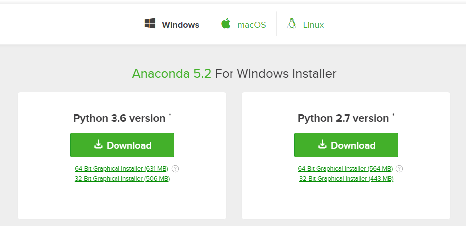
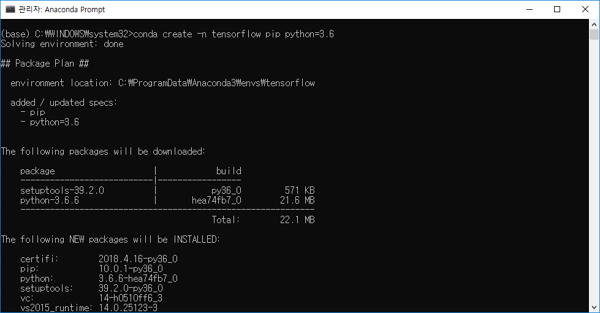
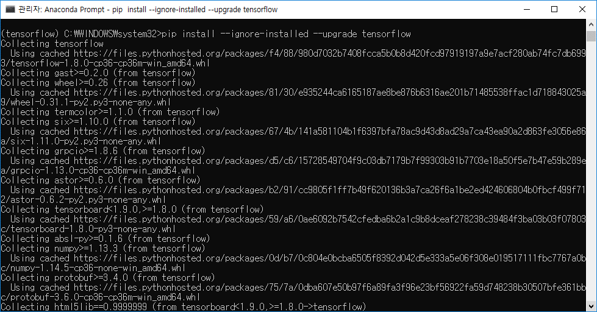
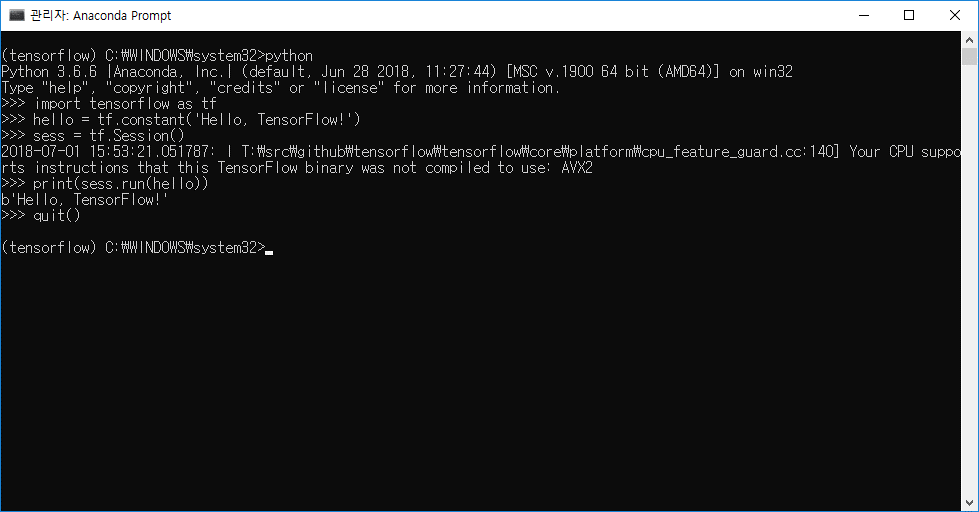
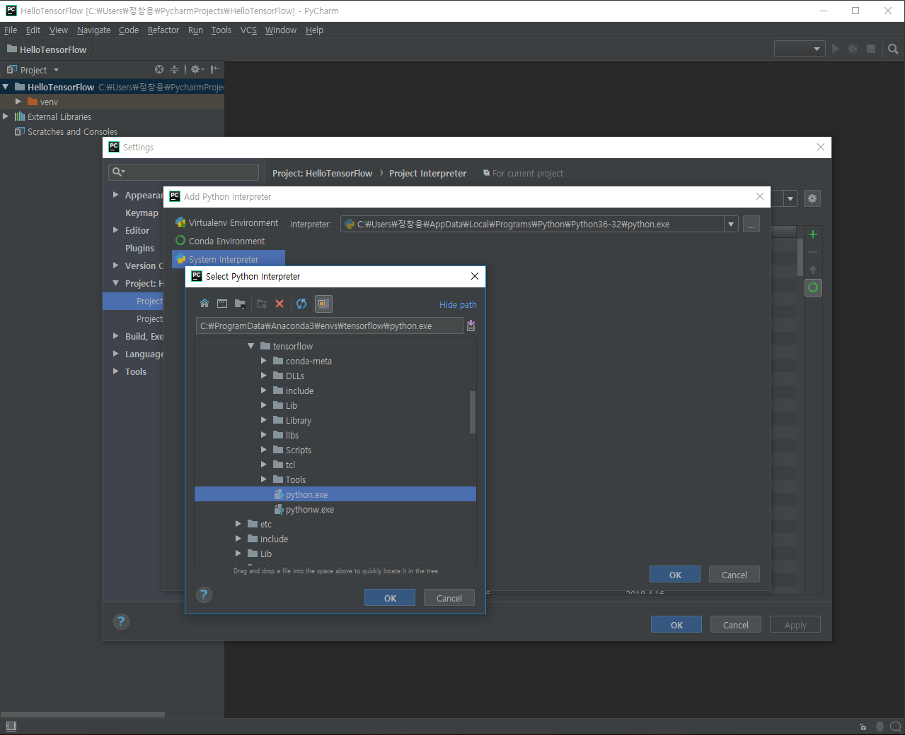
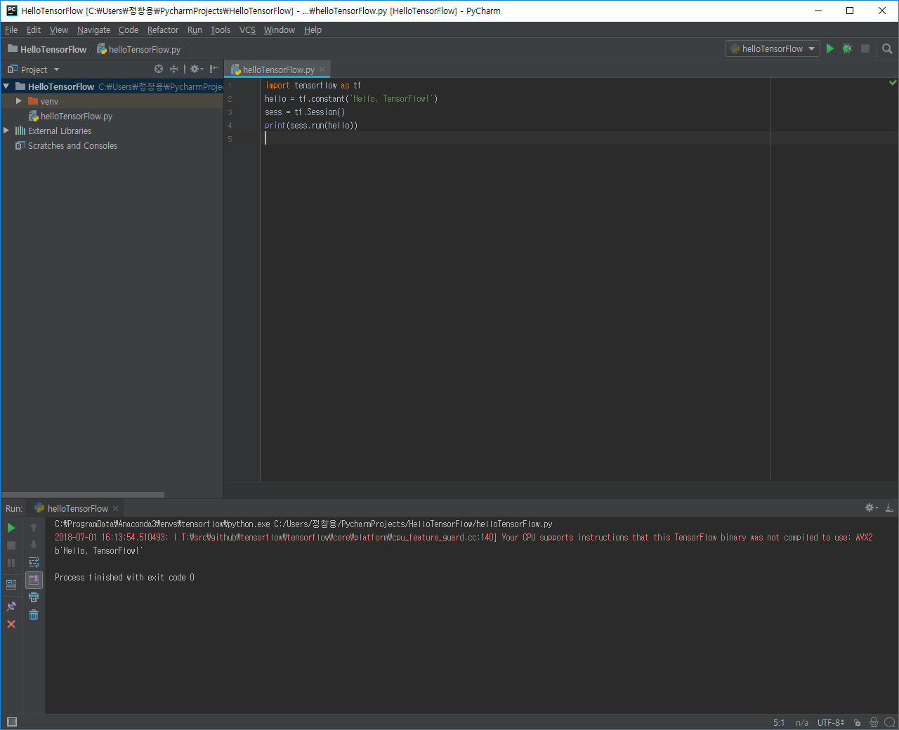

## TensorFlow란?
* Data Flow Graph를 사용하여 Numerical 계산을 하기위한 라이브러리
* 파이썬 라이브러리

### Data Flow Graph란?
* Node(=operation)와 Edge(=data or tensor)를 통해 어떠한 결과를 얻는 것
***
## TensorFlow 인스톨 for Windows
### 1. Anaconda 설치
* [Anaconda 링크](https://www.anaconda.com/download/)


### 2. tensorflow 작업전용 환경 생성
```bash
$ conda create -n tensorflow pip python=3.6
```


### 3. tensorflow 환경 활성화
```bash
$ activate tensorflow
```


### 4. tensorflow 설치
```bash
$ pip install --ignore-installed --upgrade tensorflow
```


### 5. 테스트
~~~python
import tensorflow as tf
hello = tf.constant('Hello, TensorFlow!')
sess = tf.Session()
print(sess.run(hello))
~~~


### 6. pycharm과 연동
* File > Settings > Project > Project Interpreter > Add > System Interpreter
* tensorflow 환경에 있는 Python.exe로 설정


#### 테스트


***

## TensorFlow 메커니즘
1. 그래프 생성(Node or Placeholder)
2. 그래프 실행(sess.run)
3. 그래프 업데이트 또는 출력값 리턴
### 예제 코드

```python
import tensorflow as tf
node1 = tf.constant(3.0, tf.float32)  # 노드 생성
node2 = tf.constant(4.0)   # 노드 생성
node3 = tf.add(node1, node2)  # node3 = node1 + node2

# tensor 정보만 출력
print("node1:", node1, "node2:", node2)
print("node3: ", node3)

# 결과값 출력
sess = tf.Session()  # 세션 생셩
print("sess.run(node1, node2): ", sess.run([node1, node2]))  # 세션 실행
print("sess.run(node3): ", sess.run(node3))  # 세션 실행
```

### 실행 결과
```bash
node1: Tensor("Const:0", shape=(), dtype=float32) node2: Tensor("Const_1:0", shape=(), dtype=float32)
node3:  Tensor("Add:0", shape=(), dtype=float32)
sess.run(node1, node2):  [3.0, 4.0]
sess.run(node3):  7.0

Process finished with exit code 0
```

### Placeholder
* 노드의 값을 미리 주는게 아니라 실행시킬때 사용
* sess.run 호출시 feed_dict에 값을 넘겨줌
#### 예제 코드

```python
import tensorflow as tf
a = tf.placeholder(tf.float32)
b = tf.placeholder(tf.float32)
adder_node = a+b

sess = tf.Session()
print(sess.run(adder_node, feed_dict={a: 3, b: 4.5}))
print(sess.run(adder_node, feed_dict={a: [1, 3], b: [2, 4]}))
```

#### 실행 결과
```bash
7.5
[3. 7.]

Process finished with exit code 0
```

***
### Tensor
* Array와 동일한 의미

#### Rank
* 몇 차원의 Tensor인지 나타냄

| Rank | Math entity | Example |
|:--------- |:--------- |:--------- |
| 0 | Scalar(magnitude only) | s = 483 |
| 1 | Vector(magnitude and direction) | v = [1.1, 2.2, 3.3] |
| 2 | Matrix(table of numbers) | m = [ [1, 2, 3], [4, 5, 6], [7, 8, 9] ] |
| 3 | 3-Tensor(cube of numbers) | t = [ [ [2], [4], [6] ], [ [8], [10], [12] ], [ [14], [16], [18] ] ] |
| n | n-Tensor(you get the idea) | .... |

#### Shape
* 각 Tensor에 몇 개의 원소가 들어있는지 나타냄
* t = [ [1, 2, 3], [4, 5, 6], [7, 8, 9] ] # [3, 3]의 Shape

| Shape | Dimension number | Example |
|:--------- | :--------- | :---------|
| [] | 0-D | A 0-D tensor. A scalar. |
| [D0] | 1-D | A 1-D tensor with shape[5]. |
| [D0,D1] | 2-D | A 2-D tensor with shape[3,4]. |
| [D0,D1,D2] | 3-D | A 3-D tensor with shape[1,4,3]. |
| [D0,D1,...Dn-1] | n-D | A tensor with shape [D0,D1,...Dn-1]. |

#### Type
* 일반적으로 float32 가장 많이 사용

| Data type | Python type | Description |
|:--------- | :--------- | :---------|
| DT_FLOAT | tf.float32 | 32 bits floating point. |
| DT_DOUBLE | tf.float64 | 64 bits floating point. |
| DT_INT8 | tf.int8 | 8 bits signed integer. |
| DT_INT16 | tf.int16 | 16 bits signed integer. |
| DT_INT32 | tf.int32 | 32 bits signed integer. |
| DT_INT64 | tf.int64 | 64 bits signed integer. |
***
> 본 포스트는 Youtube Sung Kim님의 강의를 정리한 내용입니다. 문제가 될 경우 삭제하겠습니다.
