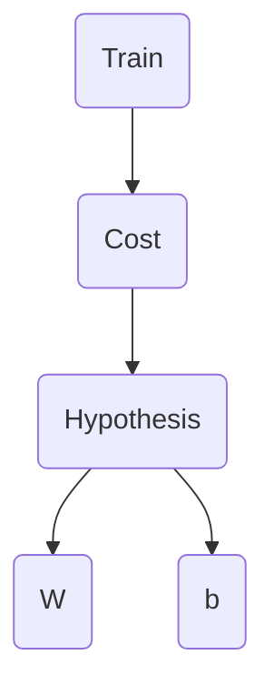

Linear Regression
===

## 1. Linear Regression 예제
### 생성 모델



### 소스코드

```python
import tensorflow as tf

# 데이터 생성
x_train = [1, 2, 3]
y_train = [1, 2, 3]

# Variable - 트레인가능한 변수
W = tf.Variable(tf.random_normal([1]), name='weight')
b = tf.Variable(tf.random_normal([1]), name='bias')

# 직선방정식
hypothesis = x_train * W + b

# 손실함수
cost = tf.reduce_mean(tf.square(hypothesis - y_train))

# GradientDescent
optimizer = tf.train.GradientDescentOptimizer(learning_rate=0.01)
train = optimizer.minimize(cost)  # 손실함수 결과를 최소화해야함

sess = tf.Session()
sess.run(tf.global_variables_initializer())  # 변수초기화, run()호출시 반드시 필요!

for step in range(2001):
    sess.run(train)
    if step % 20 == 0:
        print(step, sess.run(cost), sess.run(W), sess.run(b))
```

### 실행 결과

***
## 2. Placeholder를 사용한 Linear Regression 예제
* 노드의 값을 미리 주는게 아니라 실행시킬때 값을 전달함
### 소스코드

```python
import tensorflow as tf

# 데이터 생성
X = tf.placeholder(tf.float32, shape=[None])
Y = tf.placeholder(tf.float32, shape=[None])

# Variable - 트레인가능한 변수
W = tf.Variable(tf.random_normal([1]), name='weight')
b = tf.Variable(tf.random_normal([1]), name='bias')

# 직선방정식
hypothesis = X * W + b

# 손실함수
cost = tf.reduce_mean(tf.square(hypothesis - Y))

# GradientDescent
optimizer = tf.train.GradientDescentOptimizer(learning_rate=0.01)
train = optimizer.minimize(cost)  # 손실함수 결과를 최소화해야함

sess = tf.Session()
sess.run(tf.global_variables_initializer())  # 변수초기화, run()호출시 반드시 필요!

for step in range(2001):
    cost_val, W_val, b_val, _ = sess.run([cost, W, b, train], feed_dict={X: [1, 2, 3, 4, 5], Y: [2.1, 3.1, 4.1, 5.1, 6.1]})
    if step % 20 == 0:
        print(step, cost_val, W_val, b_val)

print(sess.run(hypothesis, feed_dict={X: [5]}))
print(sess.run(hypothesis, feed_dict={X: [2.5]}))
print(sess.run(hypothesis, feed_dict={X: [1.5, 3.5]}))

```

### 실행 결과

***
> 본 포스트는 Youtube Sung Kim님의 강의를 정리한 내용입니다. 문제가 될 경우 삭제하겠습니다.
