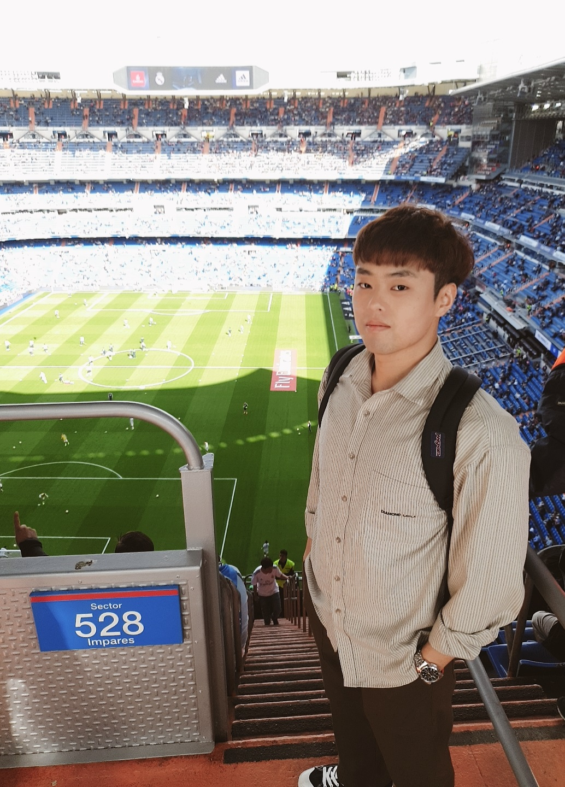

## 숭실대학교 컴퓨터학부 (2010-2017)
* 알고리즘 학술 소모임 SCCC 회장 역임 (2014)
===
## 대한민국 해군 근무 (2011-2012)
* 김포함 전산병 근무 (2011)
* 대조영함 전산병 근무 (2012)
* 소말리아 청해부대 9진 파병 (2012)
===
## 전자부품연구원 휴먼케어시스템 근무 (2014-2016)
* 10,000 사용자 이상 동시 접속 가상 데스크탑 서비스를 지원하는 클라우드 스토리지용 파일 시스템 개발
* 엑사스케일급 클라우드 스토리지 기술 개발
* 단일 노드 48TB 이상을 지원하는 개방형 하둡 스토리지 어플라이언스 개발
===
## 삼성전자 무선사업부 AI팀 근무 (2017-)
* Bixby 1.0 Chat 개발 (2017)
* Bixby 2.0 Chat 개발 (2018)